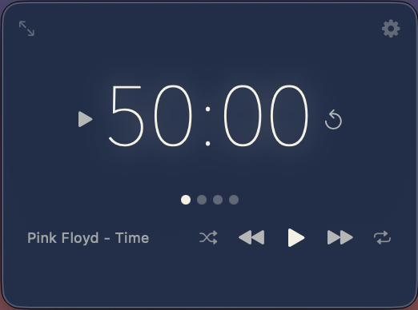
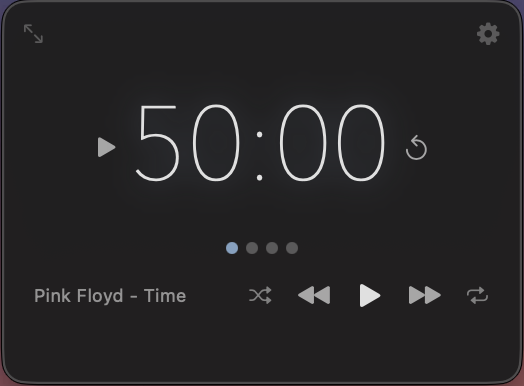
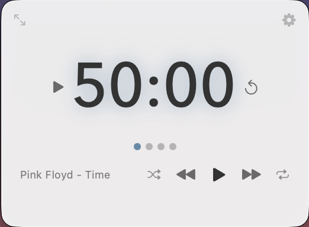
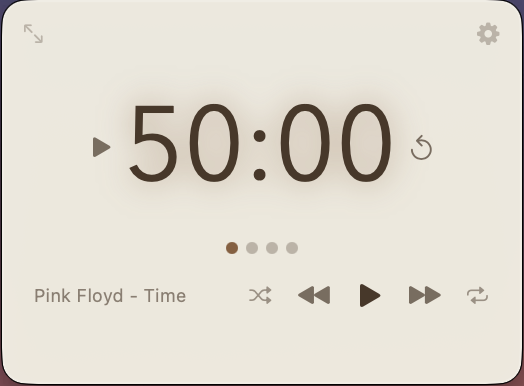
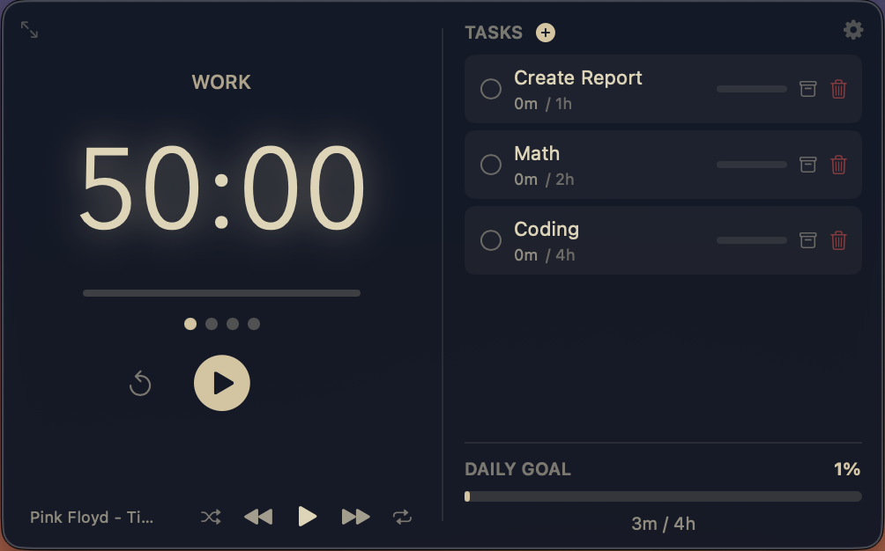
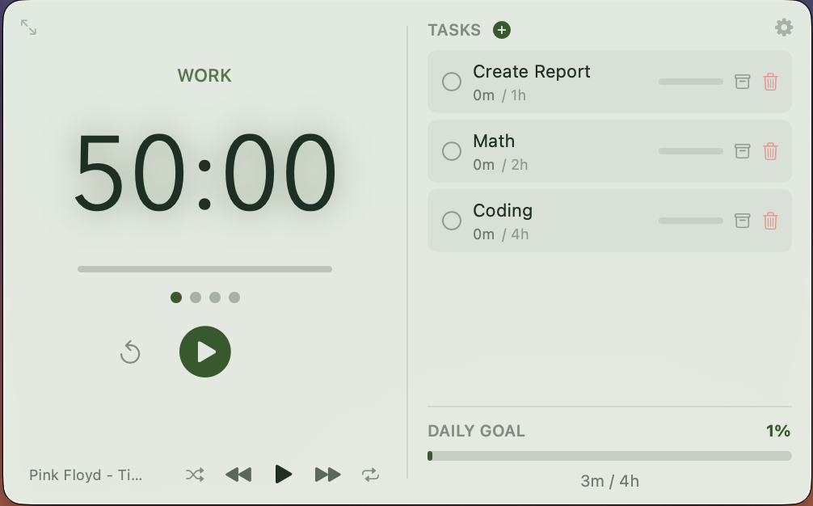
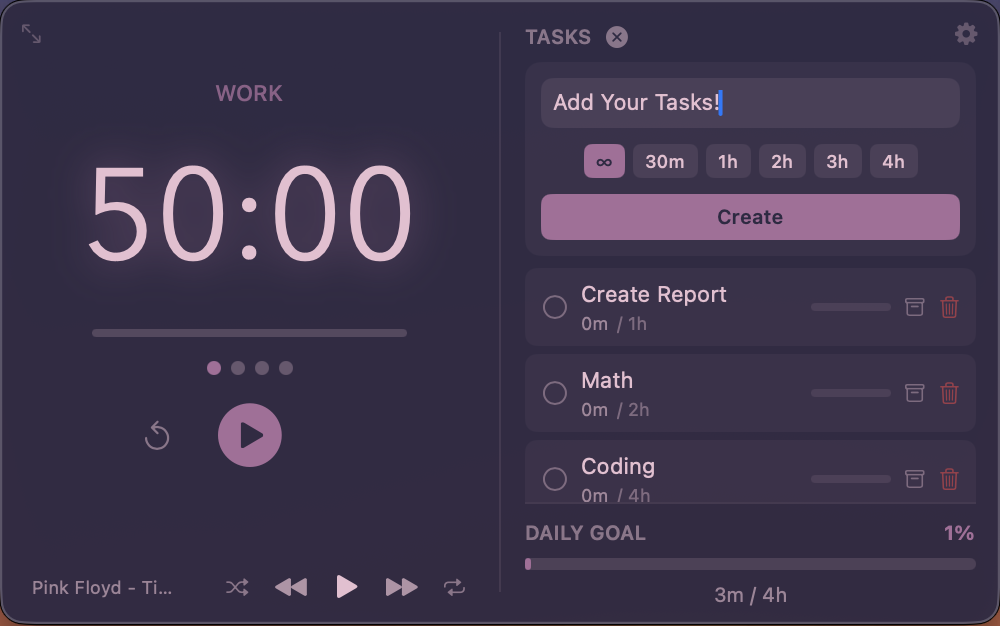
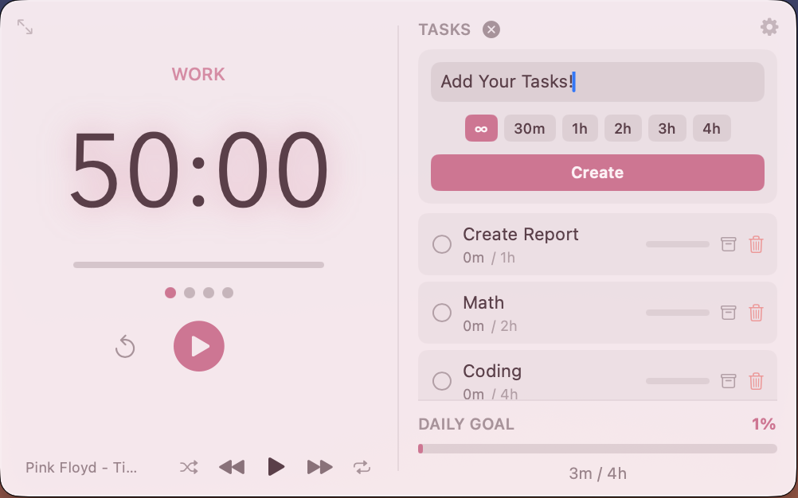
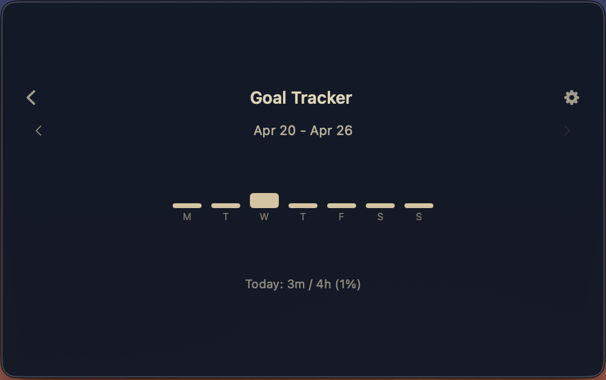
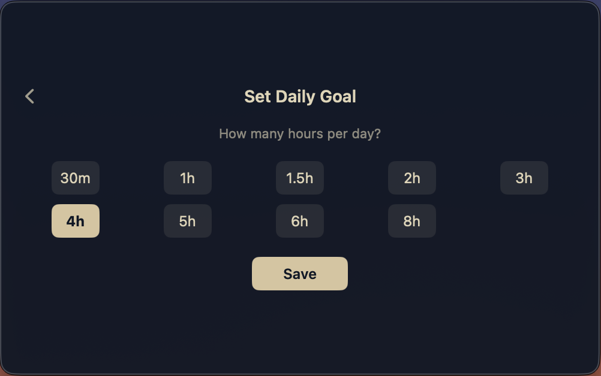

# Droplet

A beautiful, feature-rich Pomodoro timer and focus tool for macOS. Built purely with Swift and SwiftUI, Droplet lives seamlessly in your menu bar and is designed to eliminate distractions while keeping you in the flow.


### Normal Mode
| | | | |
|:---:|:---:|:---:|:---:|
|  |  |  |  |

### Detailed Mode
| | | | |
|:---:|:---:|:---:|:---:|
|  |  |  |  |

### Progress Tracking
| Goal Tracker | Set Goal |
|:---:|:---:|
|  |  |

## Features

### Core Productivity
- **Detailed View & Task Management**: View your timer and tasks side-by-side. Create tasks, assign sessions, and track your history.
- **Mini-Floater Mode**: A compact, pill-shaped window that floats above your workspace for minimal distraction.
- **Infinity Mode**: Enter a flow state and work without a time limit.
- **Guided Setup**: Configure your rhythm, daily goal, automation, appearance, sounds, and widgets from the first-run onboarding flow.
- **20-20-20 Rule (Eye Health)**: Automatically blurs your screens every 20 minutes with a gentle reminder to rest your eyes.
- **Goal Tracker**: Set daily goals and track your progress with in-app weekly bar charts.
- **Fullscreen Focus Mode**: Block out all distractions with a completely borderless fullscreen timer.

### Customization & Audio
- **15 Beautiful Themes**: Choose from carefully curated color palettes (Dark, Light, Noir, Velvet, Plum, Navy, Teal, Emerald, etc.) to match your setup.
- **Focus Sounds**: Generated white, brown, pink, green, blue, and violet noise, built-in ambient sounds, custom imports, and live volume control from the dedicated sound screen.
- **Music Controls**: Full integration with Spotify and Apple Music directly from the timer view. Auto-pauses sounds when the timer is paused.
- **Granular Settings**: Customize work/break durations, add your own workflow intervals, choose theme swatches, and tune gradient/glow, typography, sound, and window behavior.

### Native macOS Integration
- **Menu Bar Foundation**: Lives in your menu bar without cluttering your dock. Includes a live countdown option directly in the status bar.
- **Interactive UI**: Double-click to reset, click to pause/play, and right-click the menu icon for quick actions.
- **Always on Top**: Keeps the timer visible above all other windows.
- **Launch at Login**: Start automatically with macOS.
- **macOS Widgets**: Add Today, Streak Garden, and Timer Bucket widgets from Edit Widgets. Widgets are bundled with Droplet and require macOS 14 or later.

## Installation

### Download Latest Release

**[Download Droplet](https://github.com/fikretkdincer/droplet/releases/latest)**

1. Download `droplet-installer.dmg` from the latest release.
2. Open the DMG.
3. Drag `droplet` to your `Applications` folder.
4. Run the following command in your terminal to clear quarantine attributes:
   `xattr -d com.apple.quarantine /Applications/droplet.app/`
5. Launch from Applications or Spotlight.

> [!IMPORTANT]
> **macOS Security Warning**
> Since this app is not notarized with Apple, macOS will show: *"Apple could not verify droplet is free of malware"*
>
> **To open the app (choose one):**
> - **Right-click** (or Control+click) the app -> click **Open** -> click **Open** again
> - Or go to **System Settings -> Privacy & Security** -> scroll down -> click **Open Anyway**
>
> This is a one-time approval; the app will open normally after that.

> [!NOTE]
> **Music Control Permissions**
> When you first use the music controls, macOS will ask: *"Droplet wants to control Spotify/Music"*.
> Click **OK** to allow Droplet to control your active music application.

## Building from Source

Droplet uses `xcodegen` to manage its Xcode project file.

Requirements:
- macOS 13.0+
- Swift 5.9+
- XcodeGen

```bash
# Clone the repository
git clone https://github.com/fikretkdincer/droplet.git
cd droplet

# Generate the Xcode project
xcodegen

# Build the project
xcodebuild -project Droplet.xcodeproj -scheme Droplet -configuration Release build
```

## Usage Shortcuts

| Action | Effect |
|--------|--------|
| **Click Menu Bar Icon** | Toggle window visibility |
| **Right-Click Menu Bar Icon** | Open Quick Actions & Settings |
| **Click Timer** | Start/Pause timer |
| **Double-Click Timer** | Reset current session |

## License

MIT License - feel free to use and modify.
